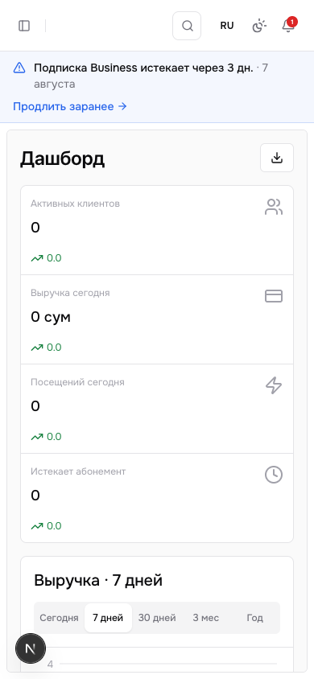
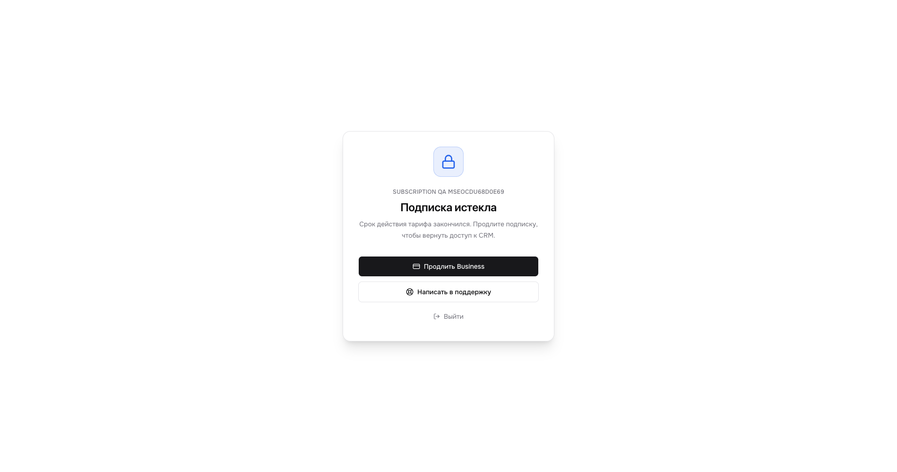
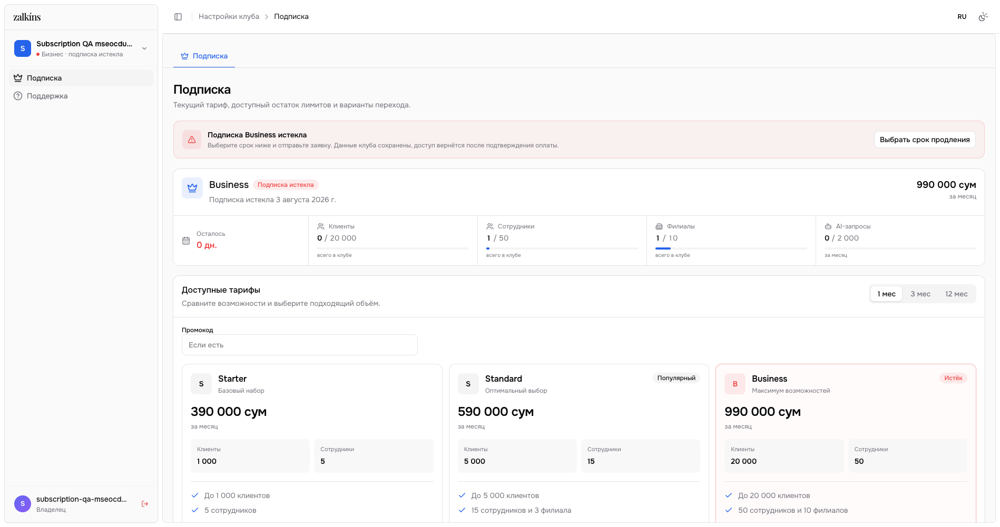
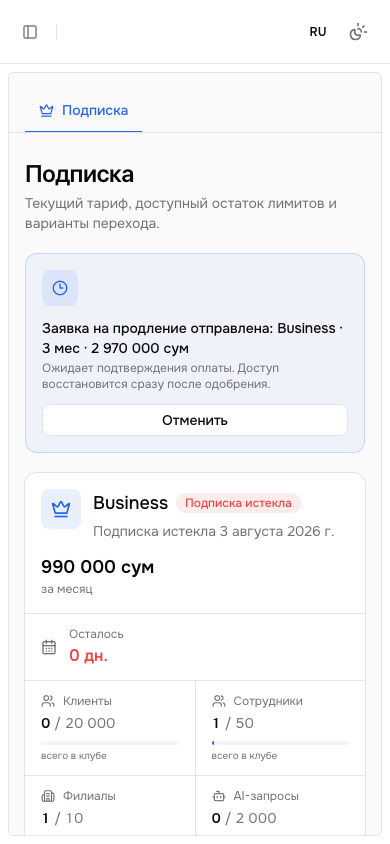

# Subscription Renewal Audit — 2026-08-04

## Scope and user goal

Проверен путь владельца клуба от предупреждения о скором окончании тарифа до восстановления
доступа после подтверждения оплаты. Главная задача пользователя: заранее понять дату окончания,
не потерять данные, продлить текущий тариф без путаницы и видеть честный статус заявки.

Аудит охватывает локальную сборку и production release `0551fa5` /
`dpl_DS1d4bbectKbM2hrWJNWDEDQqHpr`. Обе миграции и основной alias подтверждены.

## Overall health

**Healthy — production verified.** Rollout выполнен по обязательной схеме
`expand → READY app → contract`, временная approval freeze снята.

Критический UX-дефект исходного экрана закрыт: назначенный Business больше не считается активным
после истечения оплаченного периода, на карточке есть явный статус и действие продления. Данные
клуба сохраняются, а заблокированный владелец получает recovery-контур вместо тупика. Pending
заявка видна отдельно. Security review не оставил Critical/High/Medium замечаний.

## Numbered end-to-end flow

1. **Обычная работа при активном тарифе — Healthy.**
   CRM доступна полностью; название плана и entitlement остаются источником лимитов, а состояние
   оплаченного периода отдельно определяет доступ.

2. **За 7 дней до окончания — Healthy.**
   Постоянный баннер показывает тариф, точное число дней и дату, CTA ведёт прямо в продление.
   Баннер адаптируется на mobile и не перекрывает dashboard.

   

3. **Напоминания 7/3/1/0/overdue — Healthy with Low delivery caveat.**
   Cron создаёт CRM-уведомление и отправляет Telegram владельцу один раз на milestone с учётом
   языка и таймзоны клуба. Lease и уникальность защищают обычные повторы. Узкое окно повторной
   Telegram-доставки описано в разделе Residual risk.

4. **Истечение оплаченного периода — Healthy.**
   Операционная CRM блокируется до рендера защищённых данных. Владелец видит название клуба,
   понятную причину, CTA «Продлить Business», поддержку и выход. Данные не удаляются.

   

5. **Переход на экран подписки — Healthy.**
   Доступен узкий recovery shell только с «Подпиской» и «Поддержкой». Карточка Business явно
   показывает `Подписка истекла`, дату и `0 дн.`; бывший текущий тариф выделен expired-state,
   а не badge `Текущий`.

   

6. **Выбор продления — Healthy.**
   Владелец может выбрать 1/3/12 месяцев и продлить Business либо перейти на другой допустимый
   тариф. UI показывает сумму и период до отправки. Promo/compensation учитываются при quote,
   но сервер повторно валидирует их.

7. **Создание заявки — Healthy.**
   Заявка сохраняет неизменяемый снимок plan, amount, currency, months, promo и compensation.
   Только одна pending-заявка может существовать для клуба. Повторный submit не создаёт
   конкурирующие коммерческие договорённости.

8. **Ожидание оплаты — Healthy.**
   Pending показан отдельной синей карточкой с тарифом, периодом, суммой и кнопкой отмены; он не
   называется активной подпиской. Ошибка отмены больше не скрывается. Mobile reflow сохраняет
   читаемость и следующую доступную операцию.

   

9. **Одобрение Platform Admin — Healthy.**
   Atomic RPC блокирует заявку и клуб, повторно проверяет план и фактическую вместимость,
   применяет immutable quote, продлевает тот же план от `max(now, current_expiry)` или начинает
   смену плана от `now`, затем пишет audit. Оплата не снимает операционный `suspended`.

10. **Восстановление CRM — Healthy.**
    После подтверждения оплаченный период снова становится active, recovery shell исчезает и
    возвращается полный CRM-доступ. При отказе или отмене expired-state сохраняется с возможностью
    отправить новую заявку.

## Strengths

- Честное разделение `plan` и `subscription state` устраняет главный источник недоверия.
- До блокировки есть ранний CTA; после блокировки остаётся прямой путь к оплате и поддержке.
- Recovery выполняется без удаления или миграции пользовательских данных.
- Desktop и mobile используют существующую дизайн-систему, понятные semantic states и единый
  визуальный язык CRM.
- Immutable quote и атомарное approval связывают обещание UI с фактической суммой в БД.

## UX and accessibility risks

- Строгая блокировка без grace period может быть болезненной для подтверждаемого банковского
  перевода. Следующее продуктовое решение — отдельно утвердить grace/read-only policy, а не
  скрыто ослаблять текущий gate.
- Красный expired-state сопровождается текстом и иконкой, поэтому смысл не зависит только от
  цвета. Однако keyboard order, focus return после pending/cancel и screen-reader announcements
  нельзя полностью подтвердить по screenshots; нужен отдельный интерактивный accessibility pass.
- Mobile screenshots подтверждают reflow, но не являются доказательством полной WCAG compliance,
  zoom 200/400% или всех сочетаний системного размера шрифта.

## Research basis

- YCLIENTS уведомляет о скором окончании лицензии и ведёт пользователя к оплате; полезный
  локальный паттерн — сообщения за 3 дня, 1 день и после окончания:
  https://support.yclients.com/117
- YCLIENTS отдельно документирует понятный путь продления и способы оплаты:
  https://support.yclients.com/82-536--sposoby-oplaty-yclients-rf/
- Stripe различает lifecycle-состояния подписки вместо бинарного «тариф есть/нет»:
  https://docs.stripe.com/billing/subscriptions/overview
- Stripe Revenue Recovery использует настраиваемые напоминания и recovery communication:
  https://docs.stripe.com/billing/revenue-recovery/customer-emails
- Stripe Customer Portal подтверждает self-service паттерн управления текущей подпиской:
  https://docs.stripe.com/customer-management

Fitness CRM comparison, плюсы/минусы Zalkins и приоритеты automation/retention/PWA/lead pipeline
сохранены в [[Research/Competitive CRM research 2026-07-19]].

## Rollout contract — completed

1. Применена `20260804103933_platform_billing_renewal_hardening.sql` (**expand**). Она добавила
   совместимые поля/RPC и временно блокирует billing approval ошибкой
   `billing_approval_contract_pending`.
2. Совместимое приложение `0551fa5` опубликовано; deployment дождался состояния `READY`.
3. Применена `20260804110824_platform_billing_renewal_contract.sql` (**contract**). Она включила
   авторитетные DB lifecycle gates и снимает временную approval freeze.
4. Не применять expand повторно после contract: это снова включит freeze.
5. Основной alias, expired recovery, pending/approve и отсутствие operational read/write до
   продления проверены; synthetic QA club/user удалены.

## Verification

- `npm test`: **213 passed, 1 skipped**.
- `npx tsc --noEmit`: passed.
- `npm run build`: passed на Next.js 16.2.12.
- `git diff --check`: passed.
- Expand + contract проверены совместно в транзакции с `ROLLBACK`.
- Runtime rollback-сценарии подтвердили approval freeze, staff quota/invitation,
  same-plan renewal, plan change, Trial restrictions, stale permission reset и DB gates.
- Security review: нет открытых Critical/High/Medium замечаний.
- Production deployment `dpl_DS1d4bbectKbM2hrWJNWDEDQqHpr` собрал commit `0551fa5` на
  Next.js 16.2.12 и имеет статус `READY`; alias `fitcrm-three.vercel.app` обновлён.
- HTTP smoke: `/api/health` и `/login` — 200, закрытая подписка — 307 на login,
  cron без секрета — 401. Vercel error scan после E2E — clean.
- DB probes: approval freeze отсутствует, quote/owner/lifecycle guards активны, approval RPC
  доступен service role и недоступен authenticated.
- Production E2E: expiring banner, pre-render lock без полного CRM nav/data, expired renewal,
  immutable pending на 1/3 месяца, cancellation, atomic one-month approval и возврат dashboard.
- Desktop `1898×1001` и mobile `390×844`: horizontal overflow 0, browser errors отсутствуют;
  dashboard tooltip computed font — Onest.

## Residual risk

**Low — Telegram at-least-once duplicate.** Если Telegram уже принял сообщение, а финальная
запись статуса доставки в БД завершилась ошибкой, lease может быть подобран повторно и владелец
получит дубликат одного milestone. Это не открывает доступ и не меняет billing state. Для строгой
delivery semantics нужен outbox либо промежуточный статус `delivery_unknown` с reconciliation.

## Evidence index

- [Reference vs fixed, exact viewport](../../artifacts/subscription-renewal-comparison-exact-viewport-final.png)
- [Production expired desktop](../../artifacts/subscription-production-expired-desktop.png)
- [Production expired mobile](../../artifacts/subscription-production-expired-mobile.png)
- [Production recovery lock](../../artifacts/subscription-production-lock-desktop.png)
- [Production pending desktop](../../artifacts/subscription-production-pending-desktop.png)
- [Production pending mobile](../../artifacts/subscription-production-pending-mobile.png)
- [Production expiring dashboard](../../artifacts/subscription-production-expiring-dashboard-desktop.png)
- [Expired desktop, current local build](../../artifacts/subscription-renewal-expired-desktop-current.png)
- [Expired mobile, current local build](../../artifacts/subscription-renewal-expired-mobile-current.png)
- [Recovery lock desktop](../../artifacts/subscription-renewal-lock-desktop-current.png)
- [Expiring dashboard desktop](../../artifacts/subscription-expiring-dashboard-desktop-current.png)
- [Expiring dashboard mobile](../../artifacts/subscription-expiring-dashboard-mobile-current.png)
- [Pending request desktop](../../artifacts/subscription-renewal-pending-desktop-current.png)
- [Pending request mobile](../../artifacts/subscription-renewal-pending-mobile-current.png)
